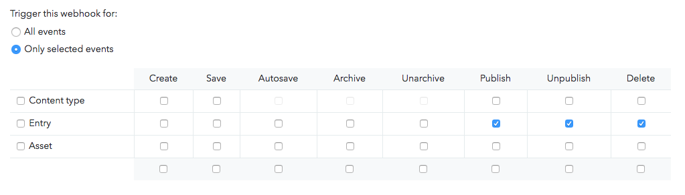

# gatsby-starter-gcn
A starter template to build amazing static websites with Gatsby, Contentful and Netlify. Heavily inspired by the  [gatsby-contentful-starter](https://github.com/contentful-userland/gatsby-contentful-starter).

## Features
* Contentful integration with ready to go placeholder content
* Netlify integration including a pre-built contact form ✌️
* Minimal responsive design - made to customize or tear apart
* Styled components
* SEO friendly

## Clone and Install
```
git clone https://github.com/ryanwiemer/gatsby-starter-gcn.git
npm i
```

## Setup
1. `npm run setup`

2. Enter in the requested info for your Contentful space found here: **app.contentful.com** -> **Space Settings** -> **API keys**  

[More detailed setup](https://github.com/contentful-userland/gatsby-contentful-starter/blob/master/README.md#set-up-of-the-needed-content-model-and-create-a-configuration-file)

## Customization

### Website Data

Edit `/src/utils/siteConfig.js`

```
module.exports = {
  siteTitle: 'GCN',
  siteDescription: 'A starter template to build amazing static websites with Gatsby, Contentful and Netlify',
  siteUrl: 'https://gcn.netlify.com',
  pathPrefix: '/'
};
```

### Styled Components Theme and Colors

Edit `/src/styles/theme.js`

```
const theme = {
  colors: {
    base: '#121212',
    secondary: '#f1f1f1',
    highlight: '#5b8bf7'
  },
  sizes: {
    maxWidth: '1200px',
    maxWidthCentered: '650px'
  },
  responsive: {
    small: '35em',
    medium: '50em',
    large: '70em'
  }
};
```

## Deployment

### Manual Netlify Deployment

1. Run `gatsby build`

2. Drag and drop the folder `/public/` into Netlify


### Netlify Deployment From Git (Recommended)

1. [New Netlify website from Git](https://app.netlify.com/start)

2. Connect with GitHub and select your repo

3. Navigate to Netlify: **Settings** -> **Build & Deploy** -> **Build Environment Variables**. Add the following environment variables using the space id and production access token from Contentful:
```
SPACE_ID
ACCESS_TOKEN
```

4. Click `trigger deploy` on the Deploys page to confirm it is building successfully. At this point every time you push to production a deploy will automatically start and be published to production.


### Setup Contentful Webhook (Optional)

1. Navigate to Netlify:
**Settings** -> **Build & Deploy** -> **Build hooks**.
Create a new build hook.

2. Navigate to Contentful:
 **app.contentful.com** -> **Space Settings** -> **Webhooks**. Create a webhook using the Netlify build URL that you just created
 and configure which events should trigger the build on production. For example the following will rebuild the production website every time a post or page is published, unpublished or deleted:



## Tips
* If you make edits to your Contentful space while running `gatsby develop` you will need to stop it and rerun the command to see the changes reflected. For example a new post or page will not automatically show up until the website has been rebuilt.

* Currently this template assumes you have at least one page and one post in Contentful. If you do not the website will fail to build.

* Remove `/static/robots.txt` if you want your website to be crawled by search engines.

* **DO NOT** store your Contentful access tokens or space ids anywhere in GitHub. Treat them like passwords.

## Todo
- [x] Add specific steps for Netlify deployment to the README
- [x] Add tips and caveats to the README
- [ ] Add better placeholder content
- [ ] Add tag pages
- [ ] Come up with a solution for a preview / staging environment
- [ ] Navigation generated by Contentful?
