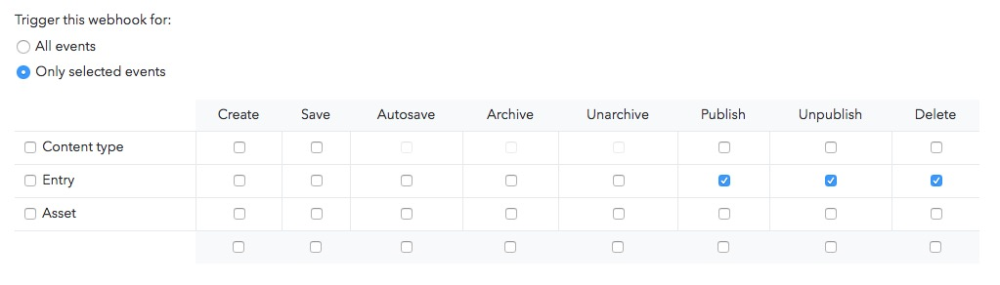

# gatsby-starter-gcn

A starter template to build amazing static websites with Gatsby, Contentful and Netlify. Inspired by [gatsby-contentful-starter](https://github.com/contentful-userland/gatsby-contentful-starter).

## Features

- Contentful integration with ready to go placeholder content
- Netlify integration including a pre-built contact form
- Minimal responsive design - made to customize or tear apart
- Pagination logic
- Theme UI
- SEO Friendly Component
  - OpenGraph sharing support
  - Sitemap Generation
- Google Analytics
- Progressive Web app
- Offline Support
- [Gatsby Standard module](https://www.npmjs.com/package/eslint-config-gatsby-standard) for linting Javascript with StandardJS
- Stylelint support for Styled Components to lint the CSS in JS

## Demo

https://gcn.netlify.com/


## Getting Started

### Install

```
git clone https://github.com/ryanwiemer/gatsby-starter-gcn.git
yarn install
```

Or via the [Gatsby CLI](https://www.npmjs.com/package/gatsby-cli)

```
gatsby new gatsby-starter-gcn https://github.com/ryanwiemer/gatsby-starter-gcn.git
```

### Setup Contentful

1.  [Sign up](https://www.contentful.com/sign-up/) for Contentful and create a new empty space

2.  `yarn run setup`

3.  Enter in the requested info for your Contentful space found here: **app.contentful.com** → **Space Settings** → **API keys**. You will need to provide both a standard API key (first tab) and a management key (second tab).

## Customization

### Website Data

Edit siteMeta data in [`/src/gatsby-config.js`](https://github.com/ryanwiemer/gatsby-starter-gcn/blob/master/src/gatsby-config.js)

```js
  siteMetadata: {
    title: 'GCN', // Title of the website
    description: // Description of the website
      'A starter template to build amazing static websites with Gatsby, Contentful and Netlify',
    siteUrl: 'https://gcn.netlify.com', // Website URL. Do not include trailing slash
    image: '/images/share.jpg', // Path to default image for SEO
    menuLinks: [ // The links used in the top menu
      {
        name: 'Home',
        slug: '/',
      },
      {
        name: 'About',
        slug: '/about/',
      },
      {
        name: 'Contact',
        slug: '/contact/',
      },
    ],
    postsPerFirstPage: 7, // Number of posts on the first page
    postsPerPage: 6, // Number of posts used on all other pages
    /*
      Root URL for posts and tags
      For example: 'blog' will result in:
        - www.example.com/blog/
        - www.example.com/blog/post-name/
        - www.example.com/blog/tag/tag-name/
    */
    basePath: '/', // Defaults to the homepage
  }
```

**Note:** If you do not see your changes reflected when developing locally you may need to run `yarn clean` followed by restarting the server via `yarn develop`.

### Theme UI

Edit [`/src/gatsby-plugin-theme-ui/index.js`](https://github.com/ryanwiemer/gatsby-starter-gcn/blob/master/src/gatsby-plugin-them-ui/index.js)

```js
export default {
  colors: {
    background: '#ffffff',
    text: '#121212',
    primary: '#121212',
    secondary: '#e9e9e9',
    tertiary: '#f3f3f3',
    highlight: '#5b8bf7',
  },
  fonts: {
    body:
      '-apple-system, BlinkMacSystemFont, "Segoe UI", Roboto, Helvetica, Arial, sans-serif',
  },
  sizes: {
    maxWidth: '1050px',
    maxWidthCentered: '650px',
  },
  responsive: {
    small: '35em',
    medium: '50em',
    large: '70em',
  },
}
```

### Using Gatsby Standard

1.  Quickly check your code for errors with the `yarn test` script
2.  You can view the [Gatsby Standard README](https://github.com/brandonkal/eslint-config-gatsby-standard) for details on how to integrate this project's included Gatsby Standard, Stylelint, and Prettier modules into your text editor

### Content and SEO

1.  You can replace the `share.jpg` and `favicon.png` files in the `static/images` directory.
2.  Meta descriptions are defined in Contentful. If you choose to leave this field blank on new posts a 320 character excerpt of the post/page will be used instead.

## Deployment

### Manual Netlify Deployment

1.  Run `gatsby build`

2.  Drag and drop the folder `/public/` into Netlify

### Netlify Deployment From Git (Recommended)

1.  [New Netlify website from Git](https://app.netlify.com/start)

2.  Connect with GitHub and select your repo

3.  Navigate to Netlify: **Settings** → **Build & Deploy** → **Build Environment Variables**. Add the following environment variables using the Space ID and Content Delivery API - access token from Contentful. Additionally if desired you can enter a Google Analytics ID. The variables must be named exactly like this in order to work properly.

```
ACCESS_TOKEN
SPACE_ID
GOOGLE_ANALYTICS
```


4.  Navigate to Netlify: **Deploys**. Click `Trigger deploy` to manually trigger a deploy to confirm the website is building successfully using your build environment variables. At this point be aware that every time you push to `master` a deploy will automatically start and be published to production.

## Additional Settings

### Contentful Webhook (Optional)

1.  Navigate to Netlify:
    **Settings** → **Build & Deploy** → **Build hooks**.
    Create a new build hook.

2.  Navigate to Contentful:
    **app.contentful.com** → **Space Settings** → **Webhooks**. Create a webhook using the Netlify build URL that you just created
    and configure which events should trigger the build on production. For example the following will rebuild the production website every time a post or page is published, unpublished or deleted:



### Netlify Form Notifications (Optional)

1.  Navigate to Netlify:
    **Forms** → **Notifications**

2.  Click the add notification dropdown and select your desired notification method.


## Useful Tips

- If you make edits to your Contentful space while running `yarn develop` you will need to stop it and rerun the command to see the changes reflected. For example a new post or page will not automatically show up until the website has been rebuilt.
- **DO NOT** store your Contentful access tokens or space ids anywhere in GitHub. Treat them like passwords.
