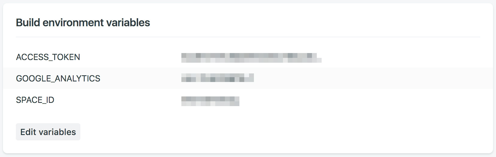

# gatsby-starter-gcn
A starter template to build amazing static websites with Gatsby, Contentful and Netlify. Inspired by [gatsby-contentful-starter](https://github.com/contentful-userland/gatsby-contentful-starter).

## Features
* Contentful integration with ready to go placeholder content
* Netlify integration including a pre-built contact form
* Minimal responsive design - made to customize or tear apart
* Styled components
* SEO friendly

## Demo
https://gcn.netlify.com/


## Getting Started

### Install
```
git clone https://github.com/ryanwiemer/gatsby-starter-gcn.git
npm i
```

Or via the [Gatsby CLI](https://www.npmjs.com/package/gatsby-cli)

```
gatsby new gatsby-starter-gcn https://github.com/ryanwiemer/gatsby-starter-gcn.git
```

### Setup Contentful

1. [Sign up](https://www.contentful.com/sign-up/) for Contentful and create a new empty space

2. `npm run setup`

3. Enter in the requested info for your Contentful space found here: **app.contentful.com** → **Space Settings** → **API keys**  

## Customization

### Website Data

Edit `/src/utils/siteConfig.js`

```
module.exports = {
  siteTitle: 'GCN',
  siteDescription: 'A starter template to build amazing static websites with Gatsby, Contentful and Netlify',
  siteUrl: 'https://gcn.netlify.com'
};
```

### Theme

Edit `/src/styles/theme.js`

```
const theme = {
  colors: {
    base: '#121212',
    secondary: '#e9e9e9',
    tertiary: '#f3f3f3',
    highlight: '#5b8bf7'
  },
  sizes: {
    maxWidth: '1200px',
    maxWidthCentered: '650px'
  },
  responsive: {
    small: '35em',
    medium: '50em',
    large: '70em'
  }
};
```

## Deployment

### Manual Netlify Deployment

1. Run `gatsby build`

2. Drag and drop the folder `/public/` into Netlify

### Netlify Deployment From Git (Recommended)

1. [New Netlify website from Git](https://app.netlify.com/start)

2. Connect with GitHub and select your repo

3. Navigate to Netlify: **Settings** → **Build & Deploy** → **Build Environment Variables**. Add the following environment variables using the space id and production access token from Contentful. They must be named exactly like this in order to work properly.

```
ACCESS_TOKEN
SPACE_ID
```



4. Navigate to Netlify: **Deploys**. Click `Trigger deploy` to manually trigger a deploy to confirm the website is building successfully using your build environment variables. At this point be aware that every time you push to `master` a deploy will automatically start and be published to production.

## Additional Settings

### Contentful Webhook (Optional)

1. Navigate to Netlify:
**Settings** → **Build & Deploy** → **Build hooks**.
Create a new build hook.

2. Navigate to Contentful:
 **app.contentful.com** → **Space Settings** → **Webhooks**. Create a webhook using the Netlify build URL that you just created
 and configure which events should trigger the build on production. For example the following will rebuild the production website every time a post or page is published, unpublished or deleted:


### Netlify Form Notifications (Optional)

1. Navigate to Netlify:
**Forms** → **Notifications**

2. Click the add notification dropdown and select your desired notification method.


## Useful Tips
* If you make edits to your Contentful space while running `gatsby develop` you will need to stop it and rerun the command to see the changes reflected. For example a new post or page will not automatically show up until the website has been rebuilt.

* Currently this template assumes you have at least **one page**, **one post** and **one tag** in Contentful. If you do not the website will fail to build.

* **DO NOT** store your Contentful access tokens or space ids anywhere in GitHub. Treat them like passwords.
