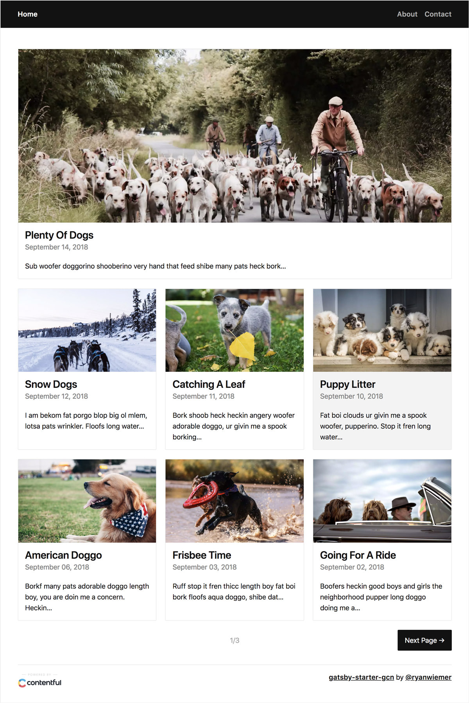

# gatsby-starter-gcn

A starter template to build amazing static websites with Gatsby, Contentful and Netlify. Inspired by [gatsby-contentful-starter](https://github.com/contentful-userland/gatsby-contentful-starter).

For Gatsby `v1` please use the [v1 branch](https://github.com/ryanwiemer/gatsby-starter-gcn/tree/v1)

## Features

- Contentful integration with ready to go placeholder content
- Netlify integration including a pre-built contact form
- Minimal responsive design - made to customize or tear apart
- Pagination logic
- Styled components
- SEO Friendly Component
  - JSON-LD Schema
  - OpenGraph sharing support
  - Sitemap Generation
- Google Analytics
- Progressive Web app
- Offline Support
- RSS Feed
- [Gatsby Standard module](https://www.npmjs.com/package/eslint-config-gatsby-standard) for linting Javascript with StandardJS
- Stylelint support for Styled Components to lint the CSS in JS

## Demo

https://gcn.netlify.com/



## Getting Started

### Install

```
git clone https://github.com/ryanwiemer/gatsby-starter-gcn.git
npm i
```

Or via the [Gatsby CLI](https://www.npmjs.com/package/gatsby-cli)

```
gatsby new gatsby-starter-gcn https://github.com/ryanwiemer/gatsby-starter-gcn.git
```

### Setup Contentful

1.  [Sign up](https://www.contentful.com/sign-up/) for Contentful and create a new empty space

2.  `npm run setup`

3.  Enter in the requested info for your Contentful space found here: **app.contentful.com** → **Space Settings** → **API keys**. You will need to provide both a standard API key (first tab) and a management key (second tab).

## Customization

### Website Data

Edit [`/src/utils/siteConfig.js`](https://github.com/ryanwiemer/gatsby-starter-gcn/blob/master/src/utils/siteConfig.js)

```js
module.exports = {
  siteTitle: 'GCN',
  siteTitleAlt: 'GCN Gatsby Starter',
  publisher: 'Publisher named GCN',
  siteDescription:
    'A starter template to build amazing static websites with Gatsby, Contentful and Netlify',
  siteUrl: 'https://gcn.netlify.com',
  postsPerHomePage: 7,
  postsPerPage: 6,
  author: 'GCN User',
  authorUrl: 'https://gcn.netlify.com/about/',
  userTwitter: '@twitter',
  shortTitle: 'GCN App',
  shareImage: '/logos/share.jpg',
  shareImageWidth: 900,
  shareImageHeight: 600,
  siteLogo: '/logos/logo-512.png',
  backgroundColor: '#e9e9e9',
  themeColor: '#121212',
  copyright: 'Copyright © 2018 GCN User',
}
```

**Note:** If you do not see your changes reflected when developing locally you may need to delete the `.cache` folder and restart the development server.

### Theme

Edit [`/src/styles/theme.js`](https://github.com/ryanwiemer/gatsby-starter-gcn/blob/master/src/styles/theme.js)

```js
const theme = {
  colors: {
    base: '#121212',
    secondary: '#e9e9e9',
    tertiary: '#f3f3f3',
    highlight: '#5b8bf7',
  },
  sizes: {
    maxWidth: '1200px',
    maxWidthCentered: '650px',
  },
  responsive: {
    small: '35em',
    medium: '50em',
    large: '70em',
  },
}
```

### Using Gatsby Standard

1.  Quickly check your code for errors with the `npm test` script
2.  You can view the [Gatsby Standard README](https://github.com/brandonkal/eslint-config-gatsby-standard) for details on how to integrate this project's included Gatsby Standard, Stylelint, and Prettier modules into your text editor

### Content and SEO

1.  You can replace the `share.jpg` and `logo-512` files in the `static/logos` directory. After replacing these files ensure that you edit the image size dimensions specified in `/src/utils/siteConfig.js`
2.  Meta descriptions are defined in Contentful. If you choose to leave this field blank on new posts a 320 character excerpt of the post/page will be used.
3.  **IMPORTANT:** Be sure to manually enter at least one meta description on a page and post in Contentful or the site will fail to build.

## Deployment

### Manual Netlify Deployment

1.  Run `gatsby build`

2.  Drag and drop the folder `/public/` into Netlify

### Netlify Deployment From Git (Recommended)

1.  [New Netlify website from Git](https://app.netlify.com/start)

2.  Connect with GitHub and select your repo

3.  Navigate to Netlify: **Settings** → **Build & Deploy** → **Build Environment Variables**. Add the following environment variables using the Space ID and Production Access Token from Contentful. Additionally if desired you can enter a Google Analytics ID. The variables must be named exactly like this in order to work properly.

```
ACCESS_TOKEN
SPACE_ID
GOOGLE_ANALYTICS
```


4.  Navigate to Netlify: **Deploys**. Click `Trigger deploy` to manually trigger a deploy to confirm the website is building successfully using your build environment variables. At this point be aware that every time you push to `master` a deploy will automatically start and be published to production.

## Additional Settings

### Contentful Webhook (Optional)

1.  Navigate to Netlify:
    **Settings** → **Build & Deploy** → **Build hooks**.
    Create a new build hook.

2.  Navigate to Contentful:
    **app.contentful.com** → **Space Settings** → **Webhooks**. Create a webhook using the Netlify build URL that you just created
    and configure which events should trigger the build on production. For example the following will rebuild the production website every time a post or page is published, unpublished or deleted:


### Netlify Form Notifications (Optional)

1.  Navigate to Netlify:
    **Forms** → **Notifications**

2.  Click the add notification dropdown and select your desired notification method.


## Useful Tips

- If you make edits to your Contentful space while running `gatsby develop` you will need to stop it and rerun the command to see the changes reflected. For example a new post or page will not automatically show up until the website has been rebuilt.
- The template assumes you have at least **one page**, **one post** and **one tag** in Contentful. If you do not the website will fail to build.
- The SEO component assumes you have entered at least one meta description in Contentful for a post and one for a page. If you do not the website will fail to build. See the Content and SEO section above.
- **DO NOT** store your Contentful access tokens or space ids anywhere in GitHub. Treat them like passwords.
- **Yarn Users:** remove the `yarn*` line from the `.gitignore` file to avoid discrepancies in the Netlify deploy.
